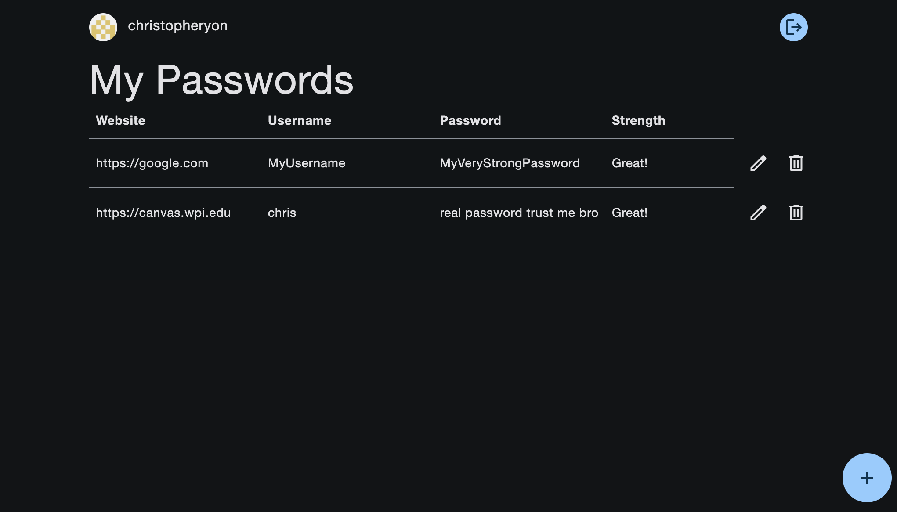

## Material Password Manager

https://a3-christopher-yon.vercel.app/

The goal of the application was to create a visually appealing and easy-to-use web-based password manager. One challenge I encountered while developing the application was converting my custom CSS to use the CSS framework, as it overrode many of my customizations and broke the layout while I figured out how to make my application conform to its expectations. However, I was left with much less and much simpler CSS, as the framework handled much of it for me, and I only had to intervene to tweak a few undesirable default behaviors and for small layout refinements. The framework I chose was Beer CSS, as it allowed me to utilize Google's attractive Material Design language with very little effort, even styling many of the standard elements by default. The remaining manual CSS was used to cleanly enforce some of the layout decisions I had made in A2, as well as to change the default color scheme using their tool to auto-generate the relevant CSS variables and keep the button animations from A2 that added expressiveness to the application. Another challenge I faced was getting authentication to work. My authentication strategy was GitHub OAuth using the Passport middleware, which I chose because it seemed like it would handle a lot of implementation details for me while striving for the OAuth technical achievement. While the GitHub strategy package maintainers provided some examples that worked out of the box, I had to research each part of their implementation to figure out how to adapt it to my specific use case. This resulted in me learning several other components, including `express-session` for session management along with `connect-mongodb-session` to keep track of sessions between server restarts using the existing MongoDB storage. Lastly, the MongoDB documentation was a little hard to understand for me, so I had to go through some trial and error before I had it working the way I wanted it to. The Express middleware packages I used:  
- express.json
  - For sending JSON in requests
- express-session
  - For session management
- passport
  - For authentication along with passport-github2
- express.static
  - For serving static resources with minimal implementation
- ensureAuthenticated custom function
  - To redirect unauthenticated users to the login page when accessing a route that requires authentication

## Screenshots

### Login Page

### Main Application

## Technical Achievements
- **Tech Achievement 1 (10 pts)**: I used OAuth authentication using Passport via the GitHub strategy. The description of my challenges implementing this can be found in the main project description.
- **Tech Achievement 2 (5 pts)**: I deployed my application on Vercel instead of Render. Once it was deployed, I found it much faster than Render for both deploying and general application performance. However, I ran into a few issues where it wasn't clear how to give it the correct start command, and even after I did, the name of the server file mattered for some reason. Lastly, I appreciated the functionality of Render to clone a public repo without linking to it as this allowed me to decide how much I wanted the hosting service to integrate with my repo. Vercel insisted on connecting to my GitHub account, and added deployment statuses to all commits with no clear way to disable them.
- **Tech Achievement 3 (5 pts)**: I got 100% on all four Lighthouse tests. The main issues I came across initially were simple missing tags from the `<head>` section. However, I also had to figure out some seemingly illogical issues, like having some buttons inside links or vice versa making Lighthouse claim there was a touch target size issue _**regardless**_ of button size. I had to fix this by defining the button actions in JavaScript rather than as links, which resulted in the exact same functionality without Lighthouse raising an issue. Finally, I had to make sure to expose the input fields during the Lighthouse test for analysis, which uncovered the additional issue of missing labels.

### Design/Evaluation Achievements
- None attempted
